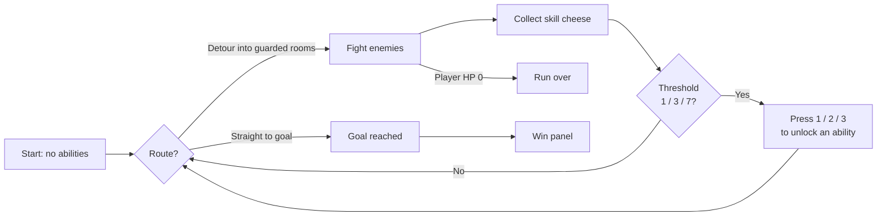
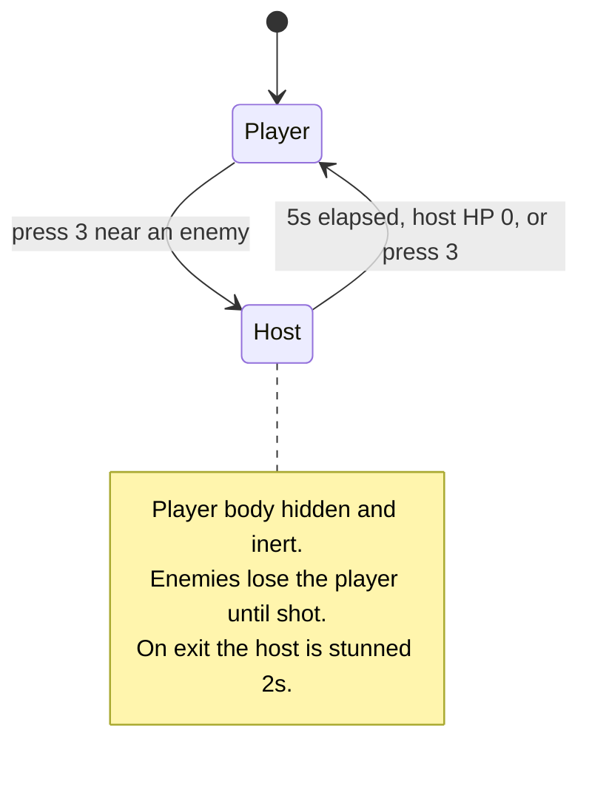

# CSCI 526 — Paired Prototype Descriptive Document

**Team:** Tianqing Lan, Diana Wan
**Game:** Escape from Sofas
**Date:** October 1, 2026

---

## 1. Logline

A 2D top-down shooter where immersive-sim powers reward committing to a fight instead of slipping past it (Top-Down Shooter + Combat-Forward Immersive Sim Powers).

---

## 2. Genre Tropes Research and Twist

### 2.1 Genre Research

We researched four immersive sims spanning the genre's history: *Thief: The Dark Project* (1998), *Deus Ex* (2000), *Dishonored* (2012) and *Prey* (2017). All
four author each level as a problem with several valid keys rather than one
intended path, and back that with a systemic world — fire, water, sound,
sightlines, carryable objects — consistent enough that players invent solutions the designers never scripted. Each hands out a scarce, self-authored power set (Augmentations, Runes, Neuromods) so no two playthroughs carry the same tools, and each is played in first person through dense, vertical, hand-crafted interiors. Most tellingly, all four privilege stealth: direct combat is made expensive and often punished outright, as with *Dishonored*'s Chaos system, so the powers exist mainly to help the player avoid a fight rather than win one.

### 2.2 Our Twist

Our twist keeps the immersive sim's systemic, self-authored power set but inverts the two tropes that frame how it is used: the camera drops from first person to 2D top-down, and the powers pay out for committing to a fight rather than avoiding one. Where *Dishonored* darkens its world as the body count rises, possession hands you a fresh body and a loaded gun — the same abilities those games issue as escape routes become the reason to engage.

---

## 3. Short Prototype Description

The player is a shooter with multiple special abilities, and must use those abilities together with their gun to kill every enemy or reach the goal. Along the way the player can either rush straight for the destination or detour through other rooms for the items that unlock new skills.

---

## 4. Twist & Mechanics Matrix

| Genre Trope | Standard Convention | Our Twist | Mechanic That Implements It |
| --- | --- | --- | --- |
| Perspective | First-person, dense vertical interiors | 2D top-down floor plan | Orthographic camera with a dead zone: the player roams a central region before the camera follows, so the whole room stays legible while a fight is read at a glance |
| Powers serve avoidance | Abilities open bypasses around a fight (Blink past a guard, hack a turret) | Abilities pay out for entering a fight | Possession: taking a host gives a fresh health pool and a loaded gun, so the reward for engaging is a second body |
| Combat is punished | Body count degrades the world (*Dishonored*'s Chaos) | Combat is the resource loop | Skill cheese is placed in the guarded side rooms, so the only way to unlock abilities is to go where the enemies are |
| Scarce, self-authored power set | Permanent upgrades chosen from a tree | Kept, but spent under fire | Three abilities, three unlock thresholds (1 / 3 / 7 cheese); an ability's own hotkey doubles as its unlock button, so the choice is made mid-run rather than in a menu |
| Stealth is the safe state | Breaking stealth means failure | Breaking stealth is recoverable | Possession reads as a disguise: enemies lose the player entirely until something shoots them, and an alert expires, so a blown approach can be re-established |
| Systemic world | Fire, water, sound, physics | Time as the system | Time Freeze stops every rigidbody, animator and particle system except the player's, including bullets already in the air |

---

## 5. GitHub Repository

**Repository:** https://github.com/lantianao/CS526_JAM

**Playable build (GitHub Pages):** https://lantianao.github.io/CS526_JAM/

---

## 6. Individual Contributions

**Tianqing Lan** — Player systems and abilities. Player controller (movement, aiming, shooting), the three abilities in `JAMSkill` (teleport with wall clamping, time freeze, possession), the shared input layer, weapon and bullet, the time-freeze system that suspends rigidbodies, animators and particles, the skill-cheese economy and its unlock thresholds, the dead-zone camera, enemy AI behaviour (detection, chase, leash, alert-on-damage, possession disguise), and the repository structure, build configuration and WebGL deployment.

**Diana Wan** — Level and interface. Built the full playable level, assembled the enemy prefab and its patrol routing, the goal trigger and win panel, and the entire HUD: pause menu, kill counter, run timer, ability-status readout, and the player and enemy health bars.

**Shared** — Both members worked on `TEST.unity` and integrated each other's branches; enemy behaviour and the health-bar lifecycle were authored by one member and debugged by the other.

---

## 7. Sketch / Diagram

**Core loop**

**Ability state — Possession**

